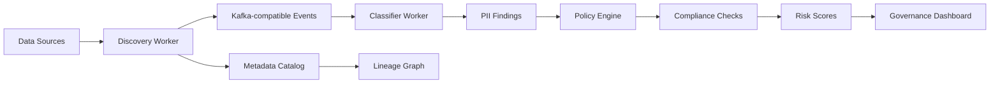
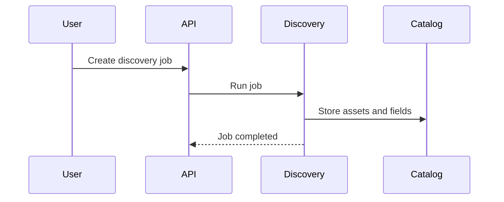
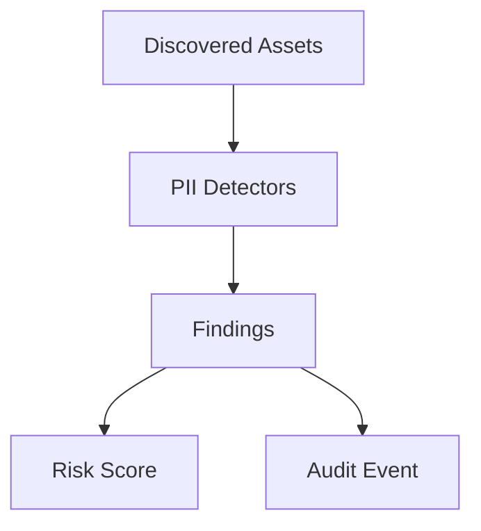
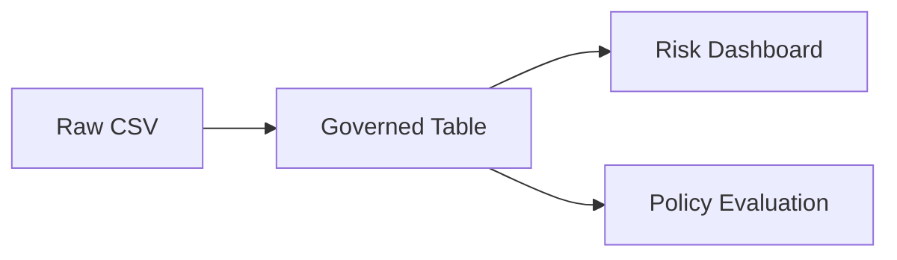
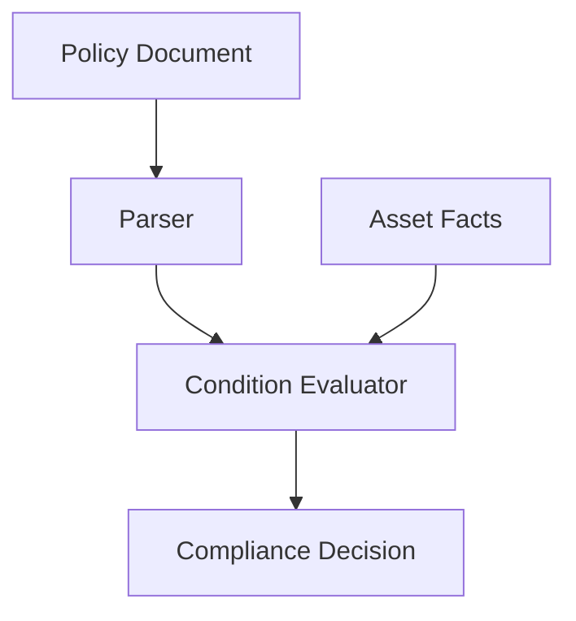

# Diagrams

## Architecture

```mermaid
flowchart LR
  Sources["Data Sources"] --> Discovery["Discovery Worker"]
  Discovery --> Catalog["Metadata Catalog"]
  Discovery --> Events["Kafka-compatible Events"]
  Events --> Classifier["Classifier Worker"]
  Classifier --> Findings["PII Findings"]
  Catalog --> Lineage["Lineage Graph"]
  Findings --> Policy["Policy Engine"]
  Policy --> Compliance["Compliance Checks"]
  Compliance --> Risk["Risk Scores"]
  Risk --> Dashboard["Governance Dashboard"]
```

## Discovery Flow

```mermaid
sequenceDiagram
  participant User
  participant API
  participant Discovery
  participant Catalog
  User->>API: Create discovery job
  API->>Discovery: Run job
  Discovery->>Catalog: Store assets and fields
  Discovery-->>API: Job completed
```

## PII Classification Flow

```mermaid
flowchart TD
  Assets["Discovered Assets"] --> Detectors["PII Detectors"]
  Detectors --> Findings["Findings"]
  Findings --> Risk["Risk Score"]
  Findings --> Audit["Audit Event"]
```

## Metadata Graph

```mermaid
flowchart LR
  Raw["Raw CSV"] --> Table["Governed Table"]
  Table --> Report["Risk Dashboard"]
  Table --> Policy["Policy Evaluation"]
```

## Policy Engine

```mermaid
flowchart TD
  Document["Policy Document"] --> Parser["Parser"]
  Parser --> Evaluator["Condition Evaluator"]
  Facts["Asset Facts"] --> Evaluator
  Evaluator --> Decision["Compliance Decision"]
```
